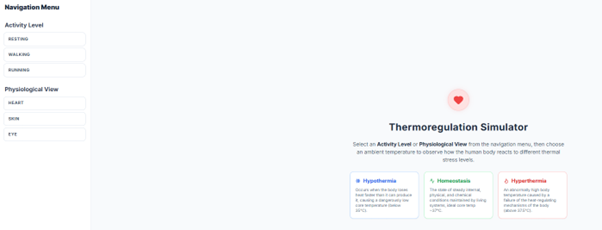
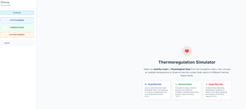
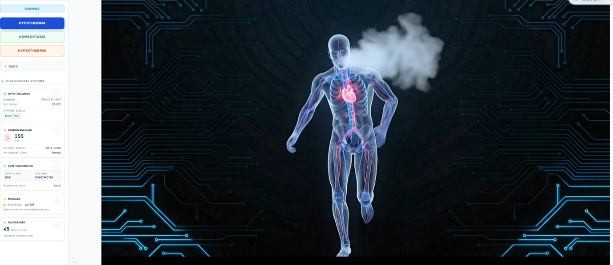
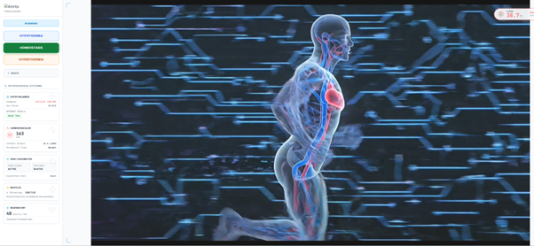
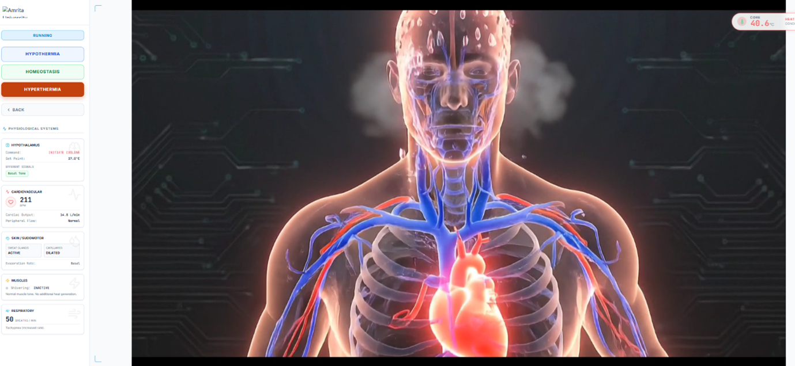
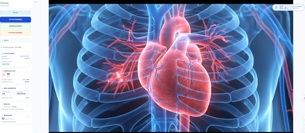
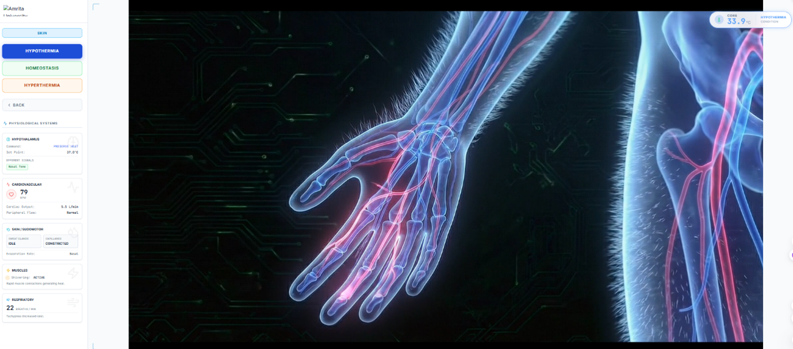
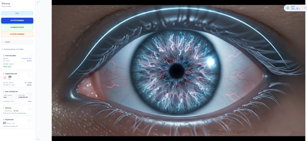

### Steps to work the simulator

1. Users can open the simulator window. The interactive GUI provides a navigation menu on the left panel and a central information panel describing thermoregulation concepts.

  

&nbsp;

&nbsp;
 
2. Navigation menu is divided into two sections like an Activity level and Physiological view. The activity level includes three different options like resting, walking, and running in which users can choose one activity to identify how different activity simulate different metabolic heat production levels. In physiological view, the GUI provides heart, skin and eye which allows the users to visualize body responses to the temperature changes.

&nbsp;

3. User were allowed to select any one of the activity levels. For example, select an activity as running.

  

&nbsp;

&nbsp;

4. After selecting an activity level, the simulator introduces three key conditions such as Hypothermia, Homeostasis and hyperthermia. These options define the external thermal environment.

&nbsp;

5. The selected options are highlighted in the navigation panel, and the simulator prepares to display physiological responses based on the activity level and thermal condition.

&nbsp;

6. After selecting Activity as Running and Condition Hypothermia, the simulator displays a dynamic human body model. The Visible cues include Cold vapor during exhalation indicating the heat loss and active body posture reflecting increased metabolic demand.

  

&nbsp;

&nbsp;

7. The GUI also allow the users to analyse the hypothalamus response showing command as preserve heat and set point as 37 degrees Celsius. This indicates the activation of the heat-gain centre to maintain core temperature.

&nbsp;

8. Observe cardiovascular changes as Heart rate is elevated (e.g., 155 bpm) , Cardiac output increases to maintain heat distribution to vital organs and the Peripheral flow remains regulated.

&nbsp;

9. Examine skin and heat conservation mechanisms: Under Skin/Sudomotor: Sweat glands: Idle and Capillaries: Constricted. It reduces heat loss by vasoconstriction.

&nbsp;

10. Observe muscular response, Under Muscles: Shivering: Active. It shows that rapid muscle contractions generate additional heat (thermogenesis).

&nbsp;

11. Analyse respiratory response, Under Respiratory: Increased breathing rate (e.g., 45 breaths/min). It Supports oxygen demand and metabolic heat production.

&nbsp;

12. Thus, the simulator showcasing an integrated system-level response in which body responds through Neural control (hypothalamus), Cardiovascular adjustments, Muscle activity (shivering) and Skin regulation (vasoconstriction). These mechanisms work together to restore body temperature toward homeostasis.

&nbsp;

13.	Similarly the interactive GUI provides the users to understand the human body thermoregulation mechanism in case of Homeostasis and Hyperthermia too.

  

&nbsp;

The physiological response of human body to the activity level running and conditions as homeostasis

  

&nbsp;

The physiological response of human body to the activity level running and conditions as hyperthermia.

&nbsp;

14. Likewise, the user can select other the activity level (resting and walking) from the navigation panel and observe the physiological response of human body to regulate human temperature.

&nbsp;

15. The navigation panel in left side also provide three different physiological views. Choose one specific organ or system view (eg.Heart)

  

&nbsp;

&nbsp;

16. The selected organ (e.g., heart) is displayed prominently, and the visual cues represent functional activity such as: Blood flow, Organ workload and Response to thermal stress.

&nbsp;

17. In the left panel, observe updated values for Heart rate, Cardiac output and Peripheral circulation. These reflect how the organ adapts under the selected condition.

&nbsp;

18. Users can correlate with thermoregulation. The organ response is linked to Heat conservation (hypothermia), Heat balance (homeostasis) and Heat dissipation (hyperthermia).

&nbsp;

19. The interactive GUI integrated with whole-body response to understand how the selected organ works together with Hypothalamus (control center), Skin (heat exchange) and Muscles (heat generation). This demonstrates coordinated physiological regulation.

&nbsp;

20. Similarly, the physiological response can visualize to other skin and eye also.

  

&nbsp;
 

  

&nbsp;

&nbsp;
 

&nbsp;

 
