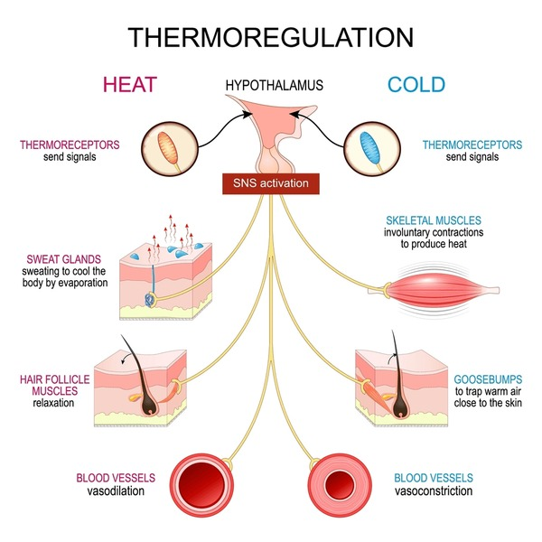
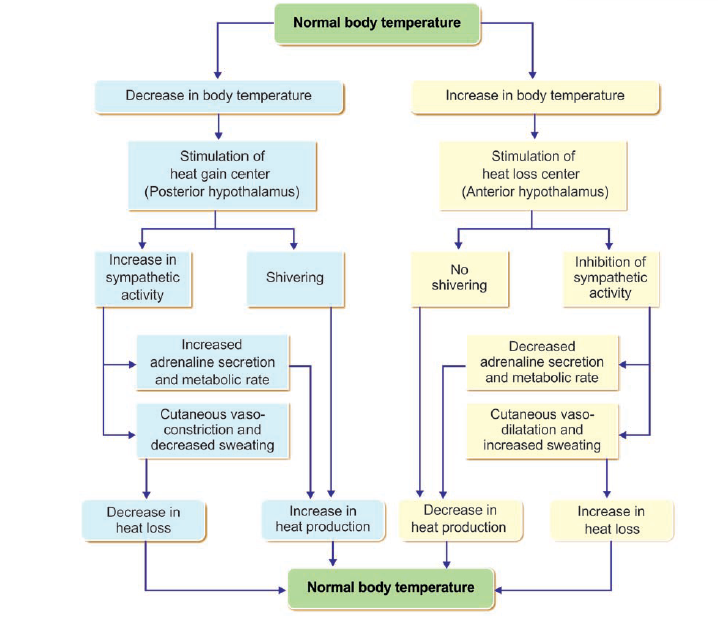

Humans are homeothermic organisms, maintaining a constant internal body temperature irrespective of environmental changes. The thermal stability in humans is important and necessary for the efficient functioning of most biochemical and enzymatic processes which occurs efficiently at a very narrow range of temperatures. Thermoregulation in human refers to the physiological process by which the body maintain a constant internal temperature of 37 degree Celsius. The temperature regulation process is made possible by a complex feedback control system that includes both peripheral thermoreceptors in the skin and central thermoreceptors in the brain. These thermoreceptors constantly monitor the temperature and send signals to the hypothalamus, which is the main regulatory centre that operates as a thermostat. The hypothalamus compares the signals received from the thermoreceptors with the normal temperature setting and takes appropriate measures to maintain temperature balance. The process of temperature regulation occurs through negative feedback, which allows for the efficient correction of any temperature deviations from the normal setting.

&nbsp;

  
   
  <i>Figure 1. Thermoregulation in humans  Source: https://www.shutterstock.com/search/body-temperature-regulation?dd_referrer=https%3A%2F%2Fwww.google.com%2F.
</i>

&nbsp;

As the physiological and environmental conditions vary, the human body reacts in specific ways. In cold environments (hypothermia), vasoconstriction and shivering are set in motion to produce heat for the body. Under normal physiological conditions (homeostasis), heat loss equals heat gain; hence, the body temperature is constant. In hot environments (hyperthermia), sweating and vasodilation are set in motion to promote heat loss from the body. However, there are situations that may interfere with this complex system by affecting the hypothalamus set point or increasing heat loss; hence, thermoregulatory balance is upset in the body. In controlled clinical settings induced hypothermia may be strategically used to reduce metabolic demand and protect tissues, demonstrating thermoregulation is not just a survival mechanism in the human body but has significant clinical implications as well.

&nbsp;

### Mechanism of Thermoregulation in Humans

#### 1. When Body Temperature Increases or Heat stress conditions: 

When the body temperature increases beyond the normal set point of about 37°C, the temperature of the blood increases too. As the temperature of the blood increases and when this warmer blood flows through the hypothalamus, mainly preoptic area (heat loss centre) and stimulates the thermosensitive neurons. These neurons activate physiological responses and aim to restore the body normal temperature by increasing the rate of heat loss and decreasing the rate of heat production.

• **Promotion of Heat loss**: The hypothalamus activates various processes that enhance the loss of heat from the body. The activities mainly involve increased sweating or evaporative cooling and cutaneous vasodilation or increased blood flow in skin. In sweating conditions, the hypothalamus activates sweat glands via the autonomic nervous system, resulting in an increased sweat secretion over the skin's surface. As sweat evaporates, it takes in latent heat from the body, thus cooling the skin and blood flowing in the skin's vessels. This is the most efficient method of heat loss, especially in hot environments or during physical exercise. Whereas as in cutaneous vasodilation, the heat loss center acts by inhibiting sympathetic vasoconstrictor impulses from the posterior hypothalamus. This causes blood vessels in the skin to dilate, resulting in an increase in blood flow to the skin's surface. This allows more heat to be lost from the core of the body to the skin's surface, where it is lost by the processes of radiation, convection, and evaporation.

• **Prevention of heat production**: At the same time, the body also prevents the production of heat internally by different mechanisms like Inhibition of Shivering which means shivering causes the production of heat by contraction of muscles which is actively inhibited. And, by reduction in metabolic Activity ie hypothalamus reduces the rate of metabolic activity that causes the production of heat.

&nbsp;

#### 2. When Body Temperature Decreases or Cold Stress Condition: 
When the body temperature drops below the normal range, the cold blood passing through the hypothalamus activates the heat gain centre in the posterior part of the hypothalamus and starts the process of restoring body temperature by minimizing heat loss and increasing heat production.

• **Prevention of heat loss**: The human body maintains its own heat through the different ways like Vasoconstriction in which the blood vessels constrict, i.e., narrow, to reduce blood flow to the skin surface, hence preventing the loss of heat. Reduced Sweating ie the sweating glands are not activated to prevent sweating, hence preventing the loss of heat and the insulation Mechanisms, in certain instances, piloerection, i.e., hair standing, occurs, but it is not effective in humans.

• **Promotion of Heat production**: For increasing the internal temperature, the human body promotes the different processes of heat production such as Shivering Thermogenesis in which muscle contractions occur rapidly, and involuntary movements promote shivering thermogenesis by increasing the metabolic rate. Non-shivering Thermogenesis where the human endocrine system regulates hormones like thyroxine and adrenaline, which promote non-shivering thermogenesis. And by increased muscle activity, Voluntary muscle movements contribute to heat generation.

&nbsp;

Thus, thermoregulation in humans is mediated by a dual regulatory system in the hypothalamus, which provides precise control of internal body temperature (Fig.2). This control mechanism has two centers: one, which promotes heat loss, is found in the anterior region of the hypothalamus, whereas the other, which promotes heat gain, is found in the posterior region. Each of these centers is selectively activated depending on whether the temperature is above or below normal.

The heat loss center is activated when there is a rise in body temperature. In response to this, it initiates a series of actions aimed at ensuring that there is loss of heat from the body, like vasodilation of cutaneous blood vessels and sweating. At the same time, it inhibits all actions that lead to the generation of more body heat, to ensure that the excessive body heat is not maintained. The heat gain center, on the other hand, is activated when the body temperature drops below the normal range. In response to this, it initiates a series of actions aimed at ensuring that there is retention of body heat, like vasoconstriction, shivering, and increased metabolic rate, to raise the body temperature to the desired level.

Both centers function by a negative feedback process that involves the constant reception of information from the thermoreceptors and the comparison of the actual temperature with the set-point temperature. Any abnormality in the temperature triggers the appropriate compensatory mechanisms that return the body temperature to normal. This balancing act of heat gain and loss is important for the maintenance of thermal stability and proper physiological functions.

&nbsp;

  
   
  <i>Figure 2. Regulation of body temperature  Source: Essentials of Medical Physiology. By K Sembulingam, Prema Sembulingam
</i>

&nbsp;

&nbsp;

